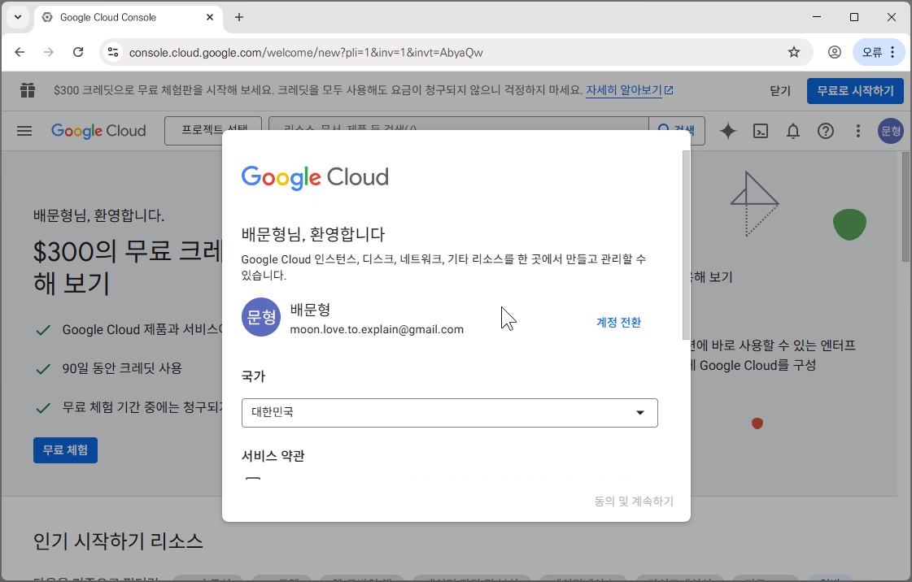

## GCP 프로젝트 생성

- 구글의 API를 사용하거나, 플레이스토어에 앱을 등록하거나, 구글의 클라우드 서비스를 이용하거나 하는 모든 구글의 개발자 관련 활동은 [Google Cloud Platform](https://console.cloud.google.com) 에서 프로젝트로 관리해야 합니다.
- 프로젝트는 단지 각 업무를 묶는 단위이며, 업무 관련 기능을 분류하는 폴더 같은 역할을 합니다.
- GMail의 API를 사용해서 Make와 연동하려면 GCP에 프로젝트를 생성해야 합니다.

---

- [console.cloud.google.com](https://console.cloud.google.com) 으로 이동합니다.


---

- GCP에 처음 접속했다면 간단한 동의항목에 체크해야 합니다.



---

- 필수 항목을 체크하고 [**동의 및 계속하기**]를 클릭합니다.


---

- [**프로젝트 선택**]을 눌러 선택 창을 열어줍니다.


---

- 새 프로젝트 클릭


---

- 적당한 이름을 입력해줍니다.


## G메일 API 사용 설정

- 프로젝트가 생성되고 [**프로젝트 선택**]을 다시 눌러줍니다.


---

- 방금 만든 프로젝트를 선택합니다.


---

- 메뉴를 엽니다.


---

- [**API 및 서비스**] - [**사용 설정된 API 및 서비스**]를 눌러줍니다.


---

- [**API 및 서비스 사용 설정**]을 눌러 API를 사용하도록 설정합니다.


---

- `gmail` 을 검색합니다.


---

- **Gmail API**를 선택해 들어갑니다.


---

- [**사용**]을 눌러 G메일 API 사용을 신청합니다.


## Google 인증 플랫폼 설정

- 각 GCP 프로젝트는 최소 '하나의 앱/서비스'를 의미합니다. 앱 또는 서비스는 나 혼자 쓰는 것이 아니라 다른 많은 불특정의 사용자가 쓸 수 있도록 구성이 되어야 합니다.
- 그래서 가상의 사용자를 가정하고, 이 사용자들이 우리의 서비스가 무엇이고 어떻게 믿을 수 있는지에 대해 알 수 있도록 정보를 제공해야 합니다.
	- 실제 다른 누군가에게 보여지지 않으므로 대충 작성해도 됩니다.
	- 물론 나 혼자 G메일 API를 쓰려고 하는 건데 이런 것까지 해야 하나 싶을 수 있습니다.
	- 하지만 시키는데 어쩔 수 없습니다. 해야 합니다.

---

- [**사용자 인증 정보 만들기**] 클릭합니다.


---

- [**사용자 데이터**]를 선택합니다.


---

- [**다음**]을 누릅니다.


---

- 적당한 이름을 입력해줍니다.


---

- 이메일을 선택해줍니다.


---

- 개발자 연락처에도 이메일 주소를 작성합니다.


---

- [**범위 추가 또는 삭제**]를 눌러 이 앱의 권한 범위를 설정합니다.
- 다른 것은 대충 작성해도 되지만 권한 범위는 중요합니다.
- 여기서 신청한 권한만 API를 통해 사용할 수 있습니다.


---

- 많은 권한 중에 필요한 것을 체크하면 됩니다.
- 항목이 많아 찾기가 어려우니 검색창을 클릭해 검색을 사용합시다.


---

- `mail`을 검색해서 G메일 API를 찾아줍니다.


---

- 범위가 `https://mail.google.com`인 항목을 체크해줍니다.


---

- 기존 검색어를 지웁니다.


---

- `userinfo`를 검색하고 `userinfo.email` 범위를 찾아 검색합니다.


---

- `.../auth/userinfo.email` 범위의 권한을 찾아 체크합니다.


---

- [**업데이트**]를 눌러 권한 설정을 마무리합니다.


---

- [**저장 후 계속**]


---

- 애플리케이션 유형을 [**웹 애플리케이션**]으로 선택합니다.


---

- 승인된 리디렉션 URI를 추가해줍니다.


---

- 아래와 같은 주소를 적고 [**만들기**]를 눌러줍니다.

```
https://www.integromat.com/oauth/cb/google-restricted
```


---

- 모든 설정을 완료했습니다.


---

- [완료]를 눌러 원래 화면으로 돌아갑시다. 


---

- [**oAuth 동의 화면**]을 클릭합니다.


---

- [**대상**]을 눌러 들어갑니다.


---

- 스크롤을 내려 테스트 사용자를 추가해줍니다.


---

- 이메일을 적고 저장 눌러줍니다.


## Client ID / Secret 얻기

- [**클라이언트**]를 클릭


---

- 만들어져있는 oAuth 클라이언트를 선택합니다.


---

- [**정보 및 요약**]을 클릭합니다.

> 화면이 충분히 크다면 클릭 안해도 우측에 나타납니다.


---

- 클라이언트 ID를 드래그해 선택하고 [Ctrl + C] 눌러 복사합니다.


--- 

- 메모장 등에 [Ctrl + V] 눌러 옮겨둡니다.


---

- 비슷하게 클라이언트 보안 비밀번호(Client Secret)도 복사한 뒤


---

- 메모장에 저장해둡니다.


## Make.com에서 G메일 모듈 연결

- 이제 `make.com` 으로 갑시다.


---

- 새로운 시나리오를 만들고, 트리거를 추가합니다.


---

- G메일 모듈을 찾아 클릭합니다.


---

- [**Watch Emails**] 모듈을 추가합니다.


---

- [**Create a Connection**]을 눌러 새 연결을 만듭니다.


---

- [**Show advanced settings**]를 체크합니다.


---

- 메모장에 보관해뒀던 ID과 Secret을 각각 복사/붙여넣기하여 넣어줍니다.


---

- [**Sign in with Google**]을 눌러 연동을 시작합니다.


---

- 등록했던 구글 계정을 선택하고


---

### 주의

- 경고에 속지 말고 [**계속**]을 클릭합니다.


---

- [**계속**]


---

- 필요한 권한을 체크해줍니다.


---

- [**계속**]을 눌러 완료해줍니다.


---

- 연동이 완료되었습니다.
- 별다른 이슈가 없다면 향후 6개월간 인증이 지속됩니다.

